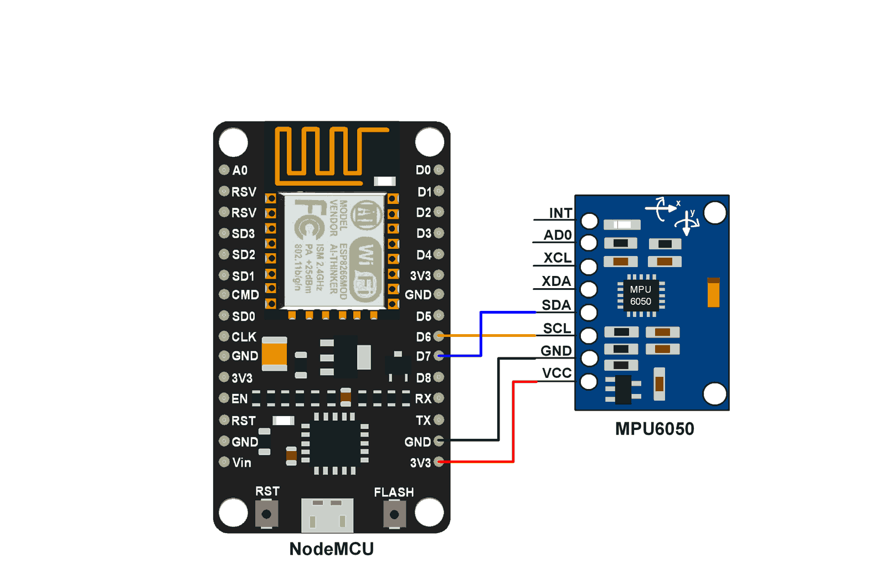
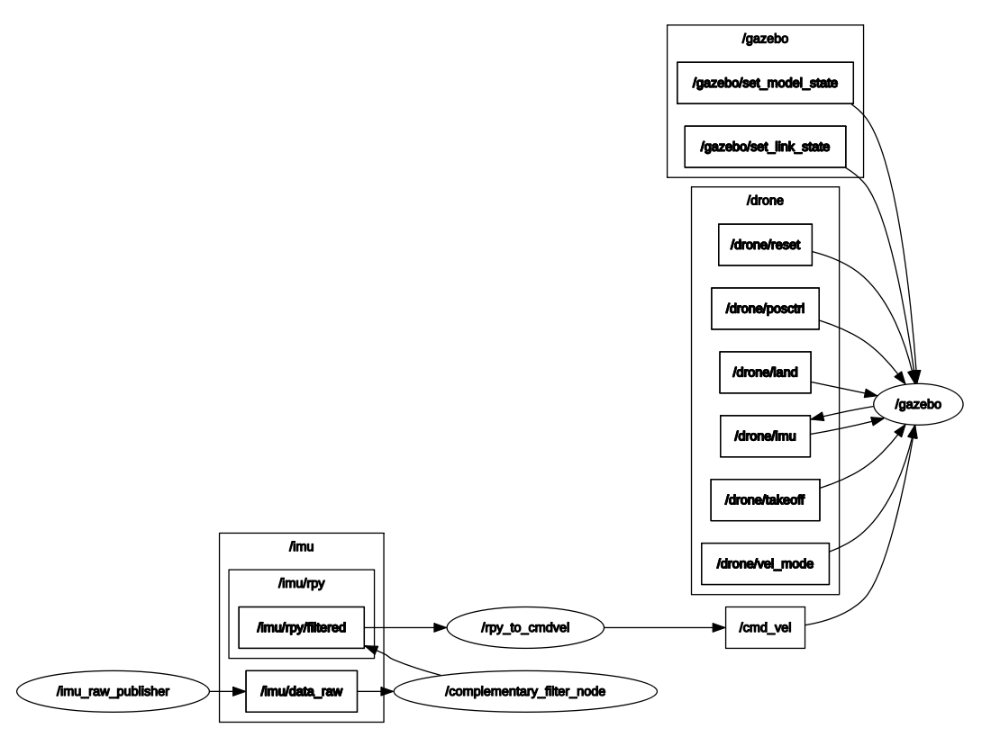

# Wireless glove controller for parrot drones 
In this project, we implement a 3d interactive glove controller that is used to control a parrot drone in Gazebo virtual environment. Using an esp8622 module (NodeMCU) and an IMU sensor (MPU6050),we obtain the orientation data then send it over UDP for semi-realtime communication. The data is then parsed, filtered and published to a ROS network where Gazebo and Rviz software can access and visualize it in 3d Space. The project is fully implemented in ROS.

## Design choices

**Embedded system**: We chose esp8622 (Node MCU Breakout) instead of Arduino because of the added wifi functionality and ease of programming. This allowed us to communicate the data over wifi with no need for serial wired communication which means better user experience and more reliable data transmission. 

**Communication protocol**: UDP was clearly more suitable than TCP since it offers lower communication latency and therefore could provide a semi-real time interaction. Despite the fact that UDP is less reliable than TCP since it might drop packets of data every now and then, it was still a very viable option for our application due to the high sampling rate that we operate on. That means we can tolerate occasional drops in control messages with little to no effect on the user experience. 

**ROS**: We chose ROS because of its wide support, efficiency and consistency. ROS offers a fairly simple and straight forward platform for data communication and module integration. The publisher-subscriber system has eliminated the overhead of integrating all the modules and communicating the data between them. Also, due to its consistency and wide support, we could use ready-made packages from github with very minor modifications. 

## Schematic and Hardware




#### Note

In case of failure to reproduce the project, try using the same versions for the Arduino IDE and its ESP board manager. Our versions were: 
Arduino IDE version == 1.8.9
ESP board manger == 2.6.0

For more details follow this [tutorial](https://randomnerdtutorials.com/how-to-install-esp8266-board-arduino-ide/) on how to upload Arduino C code to NodeMCU with Arduino IDE. However, when it comes to choosing the board manager version, refer to the version mentioned above. 

## Steps to run the whole project

1- upload the Arduino sketch in the MPU_RAW_DATA_UDP_COMM_TESTED folder. Change lines 6 and 7 according to your shared WLAN SSID and password, as suggested by the comments following those lines. Now connect your computer to that same WLAN to be on the same network and be able to communicate with NodeMCU.

2- create and setup the catkin workspace (skip if you already have your own or create another with a different name).

```bash
$ mkdir -p ~/catkin_ws/src
$ cd ~/catkin_ws/
$ catkin_make
```

3- clone this repository into your src folder

```bash
$ git clone https://github.com/MohamedKasem99/3D-drone-control-in-gazebo.git
```

4- install the ignition math library which is used by the drone simulation files.

```bash
$ sudo sh -c 'echo "deb http://packages.osrfoundation.org/gazebo/ubuntu-stable `lsb_release -cs` main" > /etc/apt/sources.list.d/gazebo-stable.list'
$ wget http://packages.osrfoundation.org/gazebo.key -O - | sudo apt-key add -
$ sudo apt-get update
$ sudo apt-get install libignition-math4-dev -y
```

5- compile all the packages so that ROS can find and run them

```bash
$ cd ~/catkin_ws
$ export CXXFLAGS=-isystem\ /usr/include/ignition/math4
$ source /opt/ros/melodic/setup.bash
$ catkin_make
$ source devel/setup.bash
$ echo "source ~/catkin_ws/devel/setup.bash" >> .bashrc
$ rospack profile
```

Now all packages are downloaded, compiled and ready to be launched.

6 - To run the ROS master, Gazebo, include simulation objects, and run the nodes for filtering and publishing cmd_vel data: 

**(optional)**

```bash
$ chmod -R u+x ~/parrot_ws/ 
```

​												==***Each command in a separate terminal window***==

```bash
$ roslaunch drone_construct main.launch 
```

```bash
$ roslaunch drone_construct intro.launch 
```

7- Next initialize the UDP listener

​												==***Each command in a separate terminal window***==

run the UDP listener. It will ask you for the IP of the NodeMCU. You can find it by either looking up the first line in the serial monitor once you reset the module or any other way of finding devices on your local wifi network. 

```bash
$ rosrun imu_raw read_sock.py 
```

Now everything is setup. All you need to do is to take off the drone. Use the following command. 

```bash
$ rostopic pub /drone/takeoff std_msgs/Empty "{}"
```

(**optional**) When you're done, you can take the drone down by the following command: 

```bash
$ rostopic pub /drone/land std_msgs/Empty "{}"
```

## How it all works

ROS works on the basis of publisher-subscriber message passing. That said, a really important step is to visualize all the topics on the network running in the background and exchanging data in a seamless but reliable manner. This is extremely helpful for debugging and understanding the flow and hierarchy of the whole project. To visualize all the topics on the network we can use the pre-shipped rqt_graph package. To run rqt_graph: 

```bash
$ rosrun rqt_graph rqt_graph
```

The following graph was obtained from rqt_graph

 


In the graph, we can see the running topics. The simplest way to explain the flow is the following:

1- obtain the IMU raw data from /imu/data_raw topic

2- filter the data by the /complementary_filter_node and publish it to /imu/rpy/filtered topic 

3- get the filtered data and convert it to command velocity messages by the /rpy_to_cmdvel node that subscribes to /imu/rpy/filtered and publishes on /cmd_vel

4- use the data published on the topic /cmd_vel to control the drone in the gazebo environment

## Challenges

In this project, we use the famous [parrot_adrone repository](https://bitbucket.org/theconstructcore/parrot_ardrone/src/master/). However, this repository was written for older ROS versions, kinetic, with the older Gazebo version 7 which means that we no longer can use the same repository. That said, we opened up the new Gazebo API and ROS references and started updating most of the ```.cpp``` files in the older repository. Also, the older Gazebo versions used ```Gazebo/math.hh ``` for math functions, yet it is no longer available in Gazebo 9 , so we used another 3rd party math library by the name ```ignition math``` and started updating all the used math functions to the ignition math library and resolved all syntax and semantic errors. 

Another challenge was installing ROS melodic itself. ROS melodic is supported on ubuntu 18.04, however, when we tried running ROS installation commands on ```elementary OS 5.1 Hera``` we ran into a problem with the first command. The solution to that is to follow this [installation guide](http://wiki.ros.org/melodic/Installation/Ubuntu), but instead of running the first command, titled "1.2 Setup your sources.list", you should run: 

```bash
$ sudo sh -c 'echo "deb http://packages.ros.org/ros/ubuntu bionic main" > /etc/apt/sources.list.d/
```

This will trick the installation into thinking that you are running the ubuntu bionic OS, when in reality you are running another OS that is based on ```ubuntu bionic``` such as ```elementary OS``` in our case.

## Quantitative analysis of UDP communication reliability 

Analysis of the UDP communication was important for us to obtain concrete measurement of the amount of lost packets over the communication link. Since data drops are random, we ran 10 trials on 10,000 transmitted messages and recorded the number of dropped/lost messages. The following graph represents our measurement and suggests that on average we should expect around 3.3% of the transmitted messages to be dropped/lost. Although this number is ridiculously high by the TCP standards, it doesn't seem to affect the smoothness of the user experience or the dynamics of the drone because of the high sampling rate.

​												 

This graph could be reproduced for a general number of trails and messages through the following python code: 

```python
#Graphing the UDP link reliablity
```

